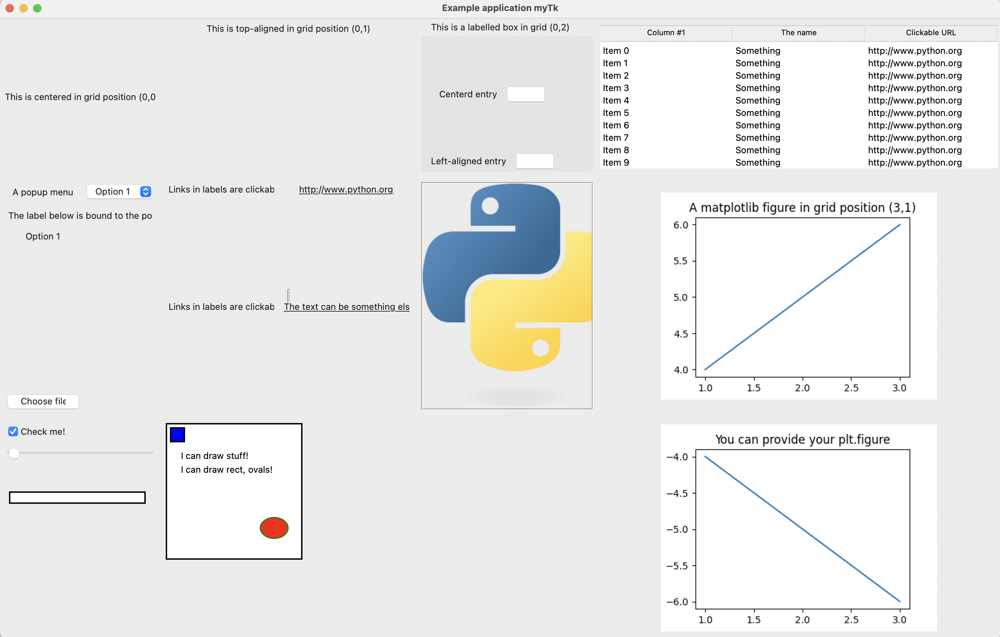
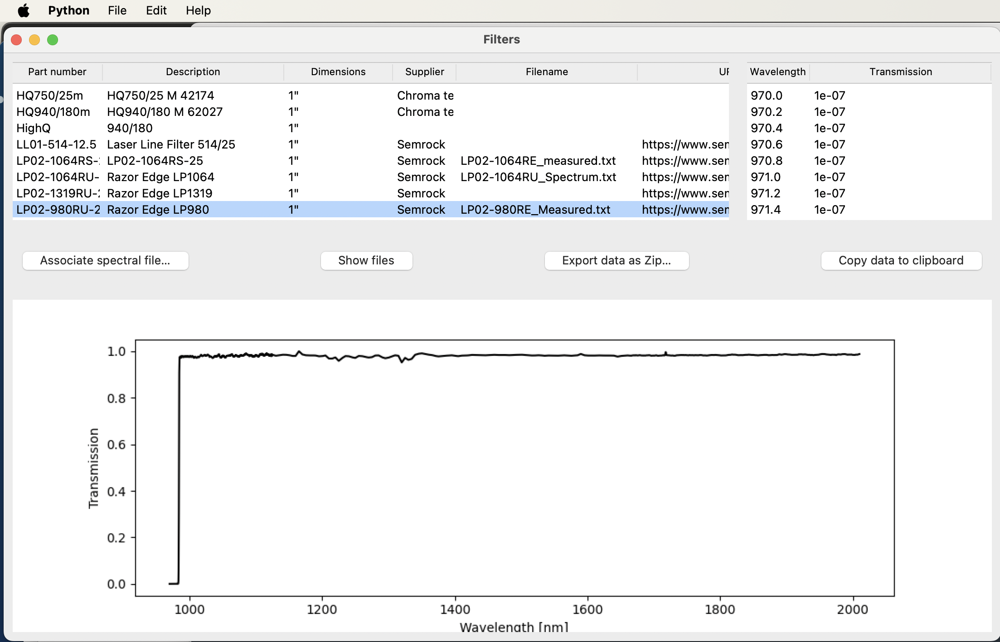

# myTk 
by Daniel C. Côté

## What is it?
Making a UI interface should not be complicated. **myTk** is a set of UI classes that simplifies the use of Tkinter to make simple (and not so simple!) GUIs in Python.

## Why Tk?
Tk comes standard with Python.  It is highly portable to all main platforms.

I know Qt, wxWidgets, and the many other ways to make an interface in Python, and I have programmed macOS since System 7 (Quickdraw, Powerplant) and Mac OS X (Carbon, Aqua, .nib and .xib files in Objective-C and in Swift).  The issues I have found with UIs in Python is either the lack of portability or the complexity of the UI strategy: 
**Qt** is very powerful but for most applications (and most scientific programmers) it is too complex, and my experience is that it is fairly fragile to transport to another device (same or different OS). On the other hand, `Tkinter` is standard on Python, but uses UI strategies that are showing their age (for example, raw function callbacks for events, inconsistent nomenclature, and some hoop jumping to get simple things done). But the advent of Themed Tk (ttk) made it look much better and modern.  It was easier to encapsulate `Tkinter` into something easy to use than to simplify Qt or other UI frameworks. This is therefore the objective of this micro-project: make `Tkinter` very simple to use for non-professional programmers.  Many common tasks have classes ready to use.

## Quickstart
```
% pip install mytk -U
% python -m mytk -h

usage: python -m mytk [-h] [-e EXAMPLES] [-c] [-l] [-t]

options:
  -h, --help            show this help message and exit
  -e, --examples EXAMPLES
                        Specific example numbers, separated by a comma
  -c, --classes         Print the class hierarchy in graphviz format
  -l, --list            List all the accessible examples
  -t, --tests           Run all Unit tests

% python -m mytk -l

 1. canvas_app.py
 2. controlpanel_app.py
 3. example.py
 4. file_calculator_app.py
 5. fileviewer_app.py
 6. filters_app.py
 7. lensviewer_app.py
 8. microscope_app.py
 9. powermeter_app.py
10. pydatagraph_app.py

% python -m mytk -e 3

/Library/Frameworks/Python.framework/Versions/3.13/bin/python3 /Library/Frameworks/Python.framework/Versions/3.13/lib/python3.13/site-packages/mytk/example_apps/example.py
(example program 3 will run, source is accessible from above path).
```

## Design
Having been a macOS programmer for a long time, I have lived through the many incarnations of UI frameworks. Over the years, I have come to first understand, and second appreciate,  good design patterns.  If interested in Design Patterns, I would recommend reading [Design Patterns](https://refactoring.guru/design-patterns). I sought to make `Tkinter` a bit more mac-like because many design patterns in Apple's libraries are particularly mature and useful.  For instance, Tkinter requires the parent of the UI-element to be specified at creation, even though there is no reason for it to be required.  In addition, the many callbacks get complicated to organize when they are all over the place, therefore when appropriate I implemented a simple strategy to handle many cases by default for the Table, and offer the option to extend the behaviour with delegate-functions (which are a bit cleaner than raw callbacks).

* All `Tkinter` widgets are encapsulated into a `View` that provides easy access to many behaviours, but the `widget` remains accessible for you to call functions directly.
* You can `bind` the property of a GUI-object (`View`) to the value of a control (another `View`).  They will always be synchronized, via the interface or even if you change them programmatically
* You can register for changes to Tkinter.Vars
* You can register a callback for an event
* You can set a delegate to manage the details 

## Layout manager
The most important aspect to understand with Tk is how to position things on screen, and I have found it quite confusing. There are three "layout managers" in Tk: `grid`, `pack` and `place`. Grid allows you to conceptually separate a view (or widget in Tk) into a grid, and place objects on that grid.  The grid may adjust its size to fit the objects (or not) depending on the options that are passed.  If the window is resized, then some columns and rows may resize, depending on options (`column/row` `weight`) and the widget itself may also resize (depending on its `sticky` options ). When adding objects, they may adjust their size or force the size of the grid element (`grid_propagate`). Finally, you can place an element in a range of rows and columns by using the `rowspan` and `columnspan` keywords.

The tutorials that helped me the most are: [pythonguis.com](https://www.pythonguis.com/faq/pack-place-and-grid-in-tkinter/) and [TkDocs](https://tkdocs.com/tutorial/index.html).


## Classes

Anything visible on screen is a referred to as a View, except the Window.

`App`: The main Application class, that holds the reference to the main window.

`Window`: A window that can hold other views

`Base`: A class grouping functions common to all View classes

`View`: A plain, empty view. It can be used as a container for other views in grid, so that the View is a single element of the grid even if it holds several elements itself also in a grid.

`PopupMenu`: A popup menu button to select an item in a list

`Label`: Static Onscreen text 

`URLLabel`: Static URL that can be clicked and opened in your webbrowser.

`Box`: A box with an optional title at the top and possibly an outline

`Entry`: An entry box for single line text

`TableView`: A Table of items. You provide headers and items in list. You can sort columns by clicking on the header. Headers can also be used to resize the columns. If a cell is a URL, it is clickable. The table can be editable.

`Figure`: A matplotlib figure. You can let Figure create the actual matplotlib.figure or provide your own.

and many others that need to be documented.  [Look at the code](https://github.com/DCC-Lab/myTk/tree/main/mytk) to find them for now.


## Getting started

The best way to learn is to look at the example applications in mytk/example_apps/ (`mytk.py`, `lensviewer_app.py`, `filters_app.py`, `microscope_app.py`, etc...). But here it is:

1. Create a subclass of `App`. 
2. In you `__init__`, first call `super().__init__`, then add you interface to the window at `self.window`. See below for examples.
   1. If you add a `Tableview`, set the `delegate` to an object of your own so that the functions are called when appropriate.  Everything is managed automatically.  The delegate can implement any or all of the following methods. 
      * `selection_changed(event)`: there is no default behaviour
      * `click_header(column)`: the default behaviour will sort the rows by this column
      * `click_cell(item_id, column_id)`: if the text starts with `http`, will try to open the link in your default browser
      * `doubleclick_header(column)`: there is no default behaviour`
      * `doubleclick_cell(item_id, column_id)`: there is no default behaviour
   2. If you add a `PopupMenu`, set the `user_callback` to act upon a change.
   3. The matplotlib `Figure` can be used by providing your own plt.figure or using the one provided by the class. There is a `toolbar` that you can add to the interface.
3. You can override the method `about(self)` or `help(self)` to provide more than the default behaviour.
4. Instantiate your app (`app = MyApp()`), then call `app.mainloop()`

The real difficulty is to understand the Layout managers of Tkinter.

## Examples

### Example 1: Demo of capabilities
The myTk code includes an example:


### A filter database

The following filter database was created with **myTk**.  As it is, it gets the data from our web server, but the code can be changed to use a local file. If you run it, it will work with our database.



```python
from mytk import *

import os
import re
import json
import tempfile
import shutil
import webbrowser
import urllib
import zipfile
import subprocess
from pathlib import Path

class FilterDBApp(App):
    def __init__(self):
        App.__init__(self, geometry="1100x650", name="Filter Database")
        self.filepath_root = 'filters_data'
        self.web_root = 'http://www.dccmlab.ca'
        self.temp_root = os.path.join(tempfile.TemporaryDirectory().name)
        self.download_files = True
        self.webbrowser_download_path = None

        self.window.widget.title("Filters")
        self.window.row_resize_weight(0,1) # Tables
        self.window.row_resize_weight(1,0) # Buttons
        self.window.row_resize_weight(2,1) # Graph
        self.filters = TableView(columns={"part_number":"Part number", "description":"Description","dimensions":"Dimensions","supplier":"Supplier","filename":"Filename","url":"URL", "spectral_x":"Wavelength", "spectral_y":"Transmission"})
        self.filters.grid_into(self.window, row=0, column=0, padx=10, pady=10, sticky='nsew')
        self.filters.widget['displaycolumn']=["part_number","description","dimensions", "supplier","filename","url"]

        self.filters.widget.column(column=0, width=100)
        self.filters.widget.column(column=1, width=200)
        self.filters.widget.column(column=2, width=120)
        self.filters.widget.column(column=3, width=70)
        self.filters.delegate = self

        self.filter_data = TableView(columns={"wavelength":"Wavelength", "transmission":"Transmission"})
        self.filter_data.grid_into(self.window, row=0, column=1, padx=10, pady=10, sticky='nsew')
        self.filter_data.widget.column(column=0, width=70)
        
        self.controls = View(width=400, height=50)
        self.controls.grid_into(self.window, row=1, column=0, columnspan=2, padx=10, pady=10, sticky='nsew')
        self.controls.widget.grid_columnconfigure(0, weight=1)
        self.controls.widget.grid_columnconfigure(1, weight=1)
        self.controls.widget.grid_columnconfigure(2, weight=1)
        self.associate_file_button = Button("Associate spectral file…", user_event_callback=self.associate_file)
        self.associate_file_button.grid_into(self.controls, row=0, column=0, padx=10, pady=10, sticky='nw')
        self.open_filter_data_button = Button("Show files", user_event_callback=self.show_files)
        self.open_filter_data_button.grid_into(self.controls, row=0, column=1, padx=10, pady=10, sticky='nw')
        self.export_filters_button = Button("Export data as Zip…", user_event_callback=self.export_filters)
        self.export_filters_button.grid_into(self.controls, row=0, column=2, padx=10, pady=10, sticky='nw')
        self.copy_data_button = Button("Copy data to clipboard", user_event_callback=self.copy_data)
        self.copy_data_button.grid_into(self.controls, row=0, column=3, padx=10, pady=10, sticky='ne')


        self.filter_plot = XYPlot(figsize=(4,4))
        self.filter_plot.grid_into(self.window, row=2, column=0, columnspan=2, padx=10, pady=10, sticky='nsew')

        self.filters_db = None
        self.load()

    def load(self):
        if self.download_files:
            self.filepath_root, filepath = self.get_files_from_web()
        else:
            filepath = os.path.join(self.filepath_root, "filters.json")

        self.filters.load(filepath)

    def get_files_from_web(self):
        install_modules_if_absent(modules={"requests":"requests"})

        import requests

        url = "/".join([self.web_root, 'filters_data.zip'])
        req = requests.get(url, allow_redirects=True)
        open('filters_data.zip', 'wb').write(req.content)

        with zipfile.ZipFile('filters_data.zip', 'r') as zip_ref:
            zip_ref.extractall(self.temp_root)
        
        return os.path.join(self.temp_root, 'filters_data'), os.path.join(self.temp_root, 'filters_data', 'filters.json')

    def save(self):
        filepath = os.path.join(self.filepath_root, "filters.json")
        self.filters.save(filepath)

    def load_filter_data(self, filepath):
        data = []
        with open(filepath,'r') as file:
            try:
                lines = file.readlines()
                for line in lines:
                    match = re.search(r'(\d+.\d*)[\s,]+([-+]?[0-9]*\.?[0-9]+([eE][-+]?[0-9]+)?)', line)
                    if match is not None:
                        try:
                            x = float(match.group(1))
                            y = float(match.group(2))
                            data.append((x,y))
                        except Exception as err:
                            # not an actual data line
                            pass

            except Exception as err:
                if len(data) == 0:
                    return None

        return data

    def load_filters_table(self, filepath):
        data = []
        with open(filepath,'r') as file:
            try:
                lines = file.readlines()
                for line in lines:
                    records = line.split('\t')
                    data.append(records)
            except Exception as err:
                if len(data) == 0:
                    return None

        return data

    def associate_file(self, event, button):
        for selected_item in self.filters.widget.selection():
            item = self.filters.widget.item(selected_item)
            record = item['values']

            part_number_idx = list(self.filters.columns.keys()).index('part_number')
            description_idx = list(self.filters.columns.keys()).index('description')
            supplier_idx = list(self.filters.columns.keys()).index('supplier')

            query = str(record[part_number_idx])+"+"+str(record[description_idx])
            query = query+f"+{record[supplier_idx]}+filter"

            webbrowser.open(f"https://www.google.com/search?q={query}")
            time.sleep(0.3)
            browser_app = subprocess.run(["osascript","-e","return path to frontmost application as text"],capture_output=True, encoding='utf8').stdout

            filepath = None

            if self.webbrowser_download_path is None:
                filepath = filedialog.askopenfilename()
            else:
                pre_list = os.listdir(self.webbrowser_download_path)
                frontmost_app = subprocess.run(["osascript","-e","return path to frontmost application as text"],capture_output=True, encoding='utf8').stdout
                while frontmost_app == browser_app:
                    self.window.widget.update_idletasks()
                    self.window.widget.update()
                    frontmost_app = subprocess.run(["osascript","-e","return path to frontmost application as text"],capture_output=True, encoding='utf8').stdout
                post_list = os.listdir(self.webbrowser_download_path)

                new_filepaths = list(set(post_list) - set(pre_list))
                if len(new_filepaths) == 1:
                    filepath = os.path.join(self.webbrowser_download_path, new_filepaths[0])
                else:
                    filepath = ''

            if filepath != '':
                shutil.copy2(filepath, self.filepath_root)
                filename_idx = list(self.filters.columns.keys()).index('filename')

                record[filename_idx] = os.path.basename(filepath)
                self.webbrowser_download_path = os.path.dirname(filepath)
                self.filters.widget.item(selected_item, values=record)
                self.save()

    def export_filters(self, event, button):
        zip_filepath = filedialog.asksaveasfilename(
            parent=self.window.widget,
            title="Choose a filename:",
            filetypes=[('Zip files','.zip')],
        )
        if zip_filepath:
            with zipfile.ZipFile(zip_filepath, 'w') as zip_ref:          
                zip_ref.mkdir(self.filepath_root)
                for filepath in Path(self.filepath_root).iterdir():
                    zip_ref.write(filepath, arcname=os.path.join(self.filepath_root,filepath.name))

    def show_files(self, event, button):
        self.reveal_path(self.filepath_root)

    def copy_data(self, event, button):
        install_modules_if_absent(modules={"pyperclip":"pyperclip"})
        try:
            import pyperclip

            for selected_item in self.filters.widget.selection():
                item = self.filters.widget.item(selected_item)
                record = item['values']

                filename_idx = list(self.filters.columns.keys()).index('filename')
                filename = record[filename_idx] 

                filepath = os.path.join(self.filepath_root, filename)
                if os.path.isfile(filepath):
                    data = self.load_filter_data(filepath)
                    
                    text = ""
                    for x,y in data:
                        text = text + "{0}\t{1}\n".format(x,y)

                    pyperclip.copy(text)
        except Exception as err:
            print(err)
            showerror(
                title="Unable to copy to clipboard",
                message="You must have the module pyperclip installed to copy the data.",
            )


    def selection_changed(self, event, table):
        for selected_item in table.widget.selection():
            item = table.widget.item(selected_item)
            record = item['values']

            filename_idx = list(self.filters.columns.keys()).index('filename')
            filename = record[filename_idx] 
            filepath = os.path.join(self.filepath_root, filename)
            
            if os.path.exists(filepath) and not os.path.isdir(filepath):

                data = self.load_filter_data(filepath)
                
                self.filter_data.empty()
                self.filter_plot.clear_plot()
                for x,y in data:
                    self.filter_data.append((x,y))
                    self.filter_plot.append(x,y)
                self.filter_plot.first_axis.set_ylabel("Transmission")
                self.filter_plot.first_axis.set_xlabel("Wavelength [nm]")
                self.filter_plot.update_plot()
                self.copy_data_button.enable()
            else:
                self.filter_data.empty()
                self.filter_plot.clear_plot()
                self.filter_plot.update_plot()
                self.copy_data_button.disable()


if __name__ == "__main__":
    package_app_script(__file__)    
    install_modules_if_absent(modules={"requests":"requests","pyperclip":"pyperclip"}, ask_for_confirmation=False)
    app = FilterDBApp()    
    app.mainloop()

```


### Example 2: Raytracing lens viewer

The following interface to the module ["Raytracing"](https://github.com/DCC-Lab/RayTracing) was created with **myTk**.  It shows a list of lenses with their properties in a Tableview, clicking on the headers will sort the rows, clicking on a link will open the URL
in a browser.  The figures underneath will reflect the properties of the selected item.


The code that generates this application is the following:
```python
from mytk import *
import raytracing as rt
import raytracing.thorlabs as thorlabs
import raytracing.eo as eo
from raytracing.figure import GraphicOf


class OpticalComponentViewer(App):
    def __init__(self):
        App.__init__(self, geometry="1450x750")


        self.window.widget.title("Lens viewer")
        self.window.resizable = False
        self.label = None
        self.menu = None
        self.default_figsize = (7, 5)
        self.header = View(width=1450, height=200)
        self.header.grid_into(
            self.window, column=0, row=0, pady=5, padx=5, sticky="nsew"
        )
        self.graphs = View(width=1450, height=700)
        self.graphs.grid_into(
            self.window, column=0, row=1, pady=5, padx=5, sticky="nsew"
        )
        self.component = None
        self.dispersion = None

        self.lenses = {}
        self.build_lens_dict()
        self.build_table()

        self.update_figure()

    def build_table(self):
        self.columns = {
            "label": "Part number",
            "backFocalLength": "Front focal length [mm]",
            "frontFocalLength": "Back focal length [mm]",
            "effectiveFocalLengths": "Effective focal length [mm]",
            "apertureDiameter": "Diameter [mm]",
            "wavelengthRef": "Design wavelength [nm]",
            "materials": "Material(s)",
            "url": "URL",
        }
        self.table = TableView(columns=self.columns)
        self.table.delegate = self
        self.table.grid_into(self.header, sticky="nsew", padx=5)

        for column in self.columns:
            self.table.widget.column(column, width=150, anchor=CENTER)
        self.table.widget.column("url", width=350, anchor=W)

        iids = []
        for label, lens in self.lenses.items():
            if lens.wavelengthRef is not None:
                wavelengthRef = "{0:.1f}".format(lens.wavelengthRef * 1000)
            else:
                wavelengthRef = "N/A"

            materials = ""
            if isinstance(lens, rt.AchromatDoubletLens):
                if lens.mat1 is not None and lens.mat2 is not None:
                    materials = "{0}/{1}".format(str(lens.mat1()), str(lens.mat2()))
            elif isinstance(lens, rt.SingletLens):
                if lens.mat is not None:
                    materials = "{0}".format(str(lens.mat()))

            iid = self.table.append(
                values=(
                    lens.label,
                    "{0:.1f}".format(lens.backFocalLength()),
                    "{0:.1f}".format(lens.frontFocalLength()),
                    "{0:.1f}".format(lens.effectiveFocalLengths()[0]),
                    "{0:.1f}".format(lens.apertureDiameter),
                    wavelengthRef,
                    materials,
                    lens.url,
                )
            )
            iids.append(iid)

        self.table.widget.selection_set(iids[0])

        scrollbar = ttk.Scrollbar(
            self.header.widget, orient=VERTICAL, command=self.table.widget.yview
        )
        self.table.widget.configure(yscroll=scrollbar.set)
        scrollbar.grid(row=0, column=1, sticky="ns")

    def update_figure(self, figure=None):
        if figure is not None:
            figure.set_size_inches(self.default_figsize)
        self.component = Figure(figure, figsize=self.default_figsize)
        self.component.grid_into(self.graphs, column=0, row=0, padx=5)
        self.dispersion = Figure(figsize=self.default_figsize)
        self.dispersion.grid_into(self.graphs, column=1, row=0, padx=5)

    @property
    def figure(self):
        return self.component.figure

    @figure.setter
    def figure(self, value):
        self.update_figure(value)

    def build_lens_dict(self):
        modules = [thorlabs, eo]

        for i, lens in enumerate(rt.CompoundLens.all()):
            for module in modules:
                try:
                    class_ = getattr(module, lens)
                    lens = class_()
                    f1, f2 = lens.effectiveFocalLengths()
                    self.lenses[lens.label] = lens
                except Exception as err:
                    pass

    def selection_changed(self, event):
        for selected_item in self.table.widget.selection():
            item = self.table.widget.item(selected_item)
            record = item["values"]
            lens = self.lenses[record[0]]  # label
            self.update_figures(lens)

    def update_figures(self, lens):
        graphic = GraphicOf(lens)
        self.figure = graphic.drawFigure().figure
        self.figure.set_size_inches((5, 5), forward=True)

        try:
            wavelengths, focalShifts = lens.focalShifts()

            axis = self.dispersion.figure.add_subplot()
            axis.plot(wavelengths, focalShifts, "k-")
            axis.set_xlabel(r"Wavelength [nm]")
            axis.set_ylabel(r"Focal shift [mm]")
        except Exception as err:
            pass

    def about(self):
        showinfo(
            title="About Lens Viewer",
            message="A lens viewer for the Raytracing package by the DCC/M Lab.",
        )

    def help(self):
        webbrowser.open("https://raytracing.readthedocs.io/")

    def doubleclick_cell(self, item_id, column_id, item_dict):
        value = item_dict["values"][column_id - 1]
        pyperclip.copy(value)
        return True


if __name__ == "__main__":
    rt.silentMode()
    app = OpticalComponentViewer()

    from packaging.version import Version
    if Version(rt.__version__) <= Version("1.3.10"):
        showerror(title="Minimum Raytracing version", message="You need at least Raytracing 1.3.11 to run the lens viewer", icon=ERROR)
    else:
        app.mainloop()

```
